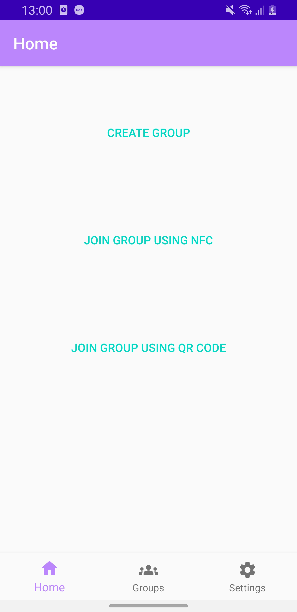
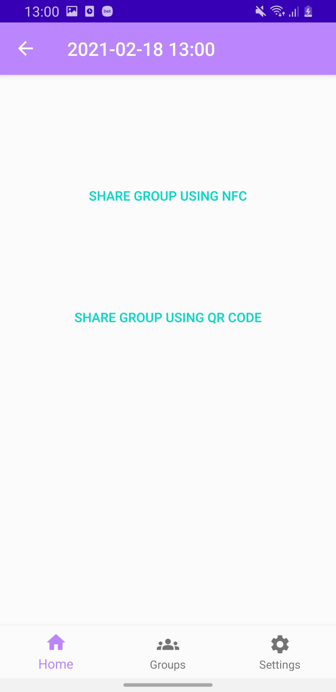
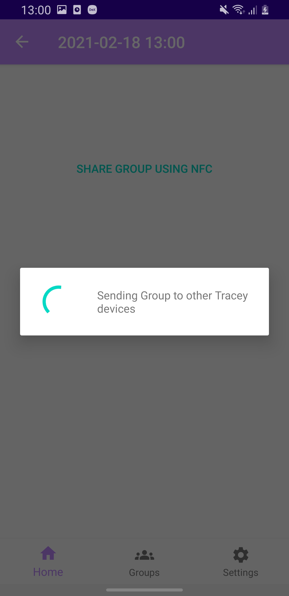
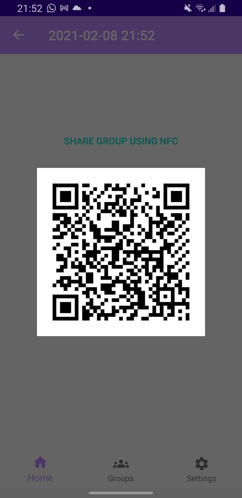
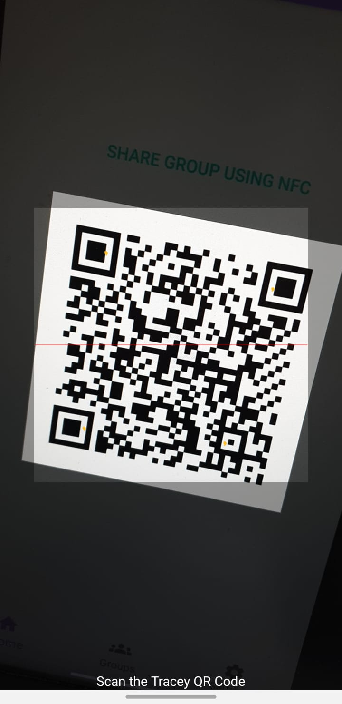
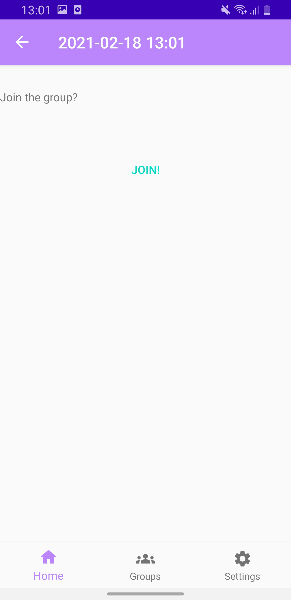
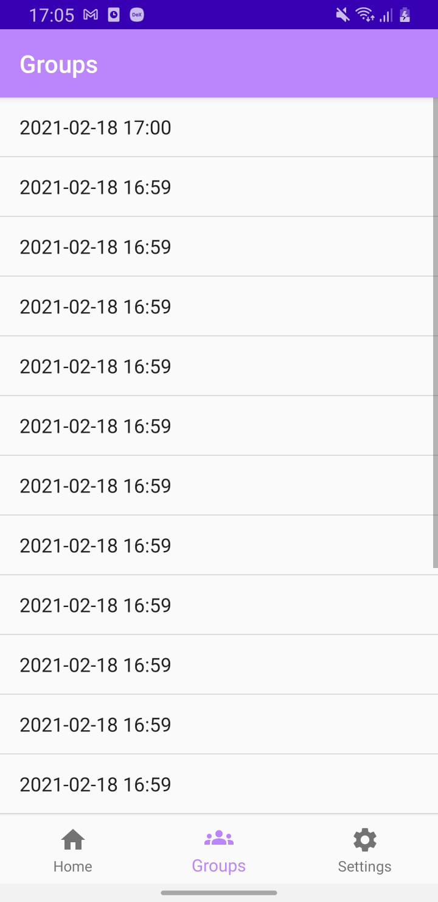

# Trace Yourself - It Could Be Easy
This repository contains our prototype for Tracey's NFC and QR-code based tracing implemented for Android OS.

**Disclaimer: This project is a proof of concept. The code as well as the concept are not suited for production use.**

## Overview of Tracey
Whenever two persons meet, they create an encounter-based secret.
In case of an infection, the infected party notifies all encounters using the individual secrets.
While a public database distributes those notifications, only the original parties receive them.
In addition to personal contacts, groups can also share a secret.
The secrets can either be generated on demand or in advance.

## About This Prototype
This project contains an example Android application. The prototype supports sharing secrets using both QR codes and NFC.
The app switches NFC's active and passive mode to allow bidirectional connections with other smartphones, smart cards and also smartwatches.
Currently, the prototype receives notifications also using QR codes.

## Screenshots

## Todos
* Add QR code notification and allow scanning and parsing using the QR code scanner
* Provide screenshots for Android App
* Add source code for notification database
* Move notification handling to separate project and program
